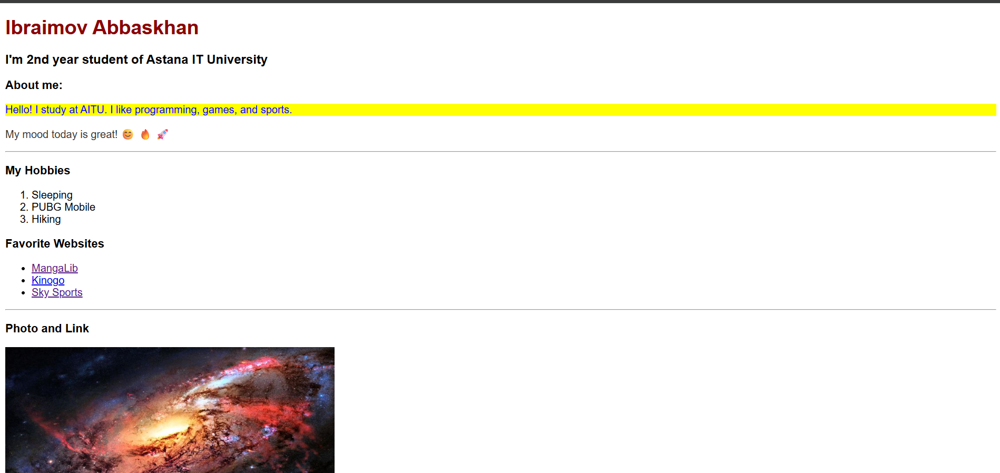
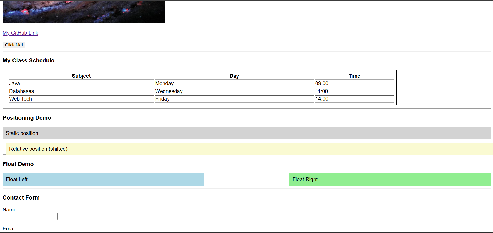

# Assignment #1: HTML & CSS Basics

**Student Name:** Ibraimov Abbaskhan  
**Group:** IT-2501  
**Course:** Web Technologies / Front-End Development  
**University:** Astana IT University  

---

##  Project Objective
The objective of this assignment is to demonstrate foundational skills in Front-End Web Development by building a personal web page using HTML5 and CSS3. 

Key learning outcomes include:
- Structuring HTML documents with semantically correct tags.
- Building structured data layouts using tables, lists, and forms.
- Understanding and applying CSS styles via inline, internal, and external methods.
- Utilizing CSS Selectors (Element, Class, and ID).
- Mastering the CSS Box Model (margins, padding, borders).
- Applying CSS positioning, floating elements, and relative sizing units (`rem`, `em`, `px`, `%`).
- Publishing a static webpage via GitHub Pages.

---

##  Step-by-Step Task Breakdown

### Part 1: Introduction to HTML
- **Step 0:** Initialized the standard HTML5 boilerplate (`<!DOCTYPE html>`, `<html>`, `<head>`, `<title>My First Webpage</title>`, `<body>`).
- **Step 1:** Structured introductory text using `<h1>`, `<h2>`, and `<h3>` tags alongside a bio paragraph.
- **Step 2:** Created an ordered list (`<ol>`) for personal hobbies and an unordered list (`<ul>`) for favorite websites.
- **Step 3:** Embedded a personal image using `` with proper `src` and `alt` attributes, and included clickable links using `<a>` tags with `target="_blank"`.
- **Step 4:** Added an interactive `<button>` element.

### Part 2: Intermediate HTML
- **Step 5:** Built a class schedule table (`<table>`) containing 3 columns (`Subject`, `Day`, `Time`) with structured table headers (`<th>`) and rows (`<tr>`, `<td>`).
- **Step 7:** Included expressive emojis inside a paragraph describing daily mood.
- **Step 8:** Constructed a contact form (`<form>`) with typed inputs (`text`, `email`, `color`) wrapped with `<label>` elements and a submit button.

### Part 3: Introduction to CSS
- **Step 9–12:** Connected three types of styling:
  - *Inline CSS:* Applied directly inside the paragraph tag (`style="color: blue;"`).
  - *Internal CSS:* Embedded in the `<head>` section using `<style>` tags.
  - *External CSS:* Linked an external `style.css` stylesheet using `<link rel="stylesheet">`.
- **Step 13–14:** Demonstrated selector precedence:
  - Element Selectors (`p`, `h2`, `h3`)
  - Class Selector (`.highlight`)
  - ID Selector (`#main-heading`)

### Part 4: Intermediate CSS
- **Step 15:** Added a site icon (favicon) using `<link rel="icon">`.
- **Step 16:** Grouped logical page sections using `
` container elements.
- **Step 17:** Applied Box Model mechanics (`margin`, `padding`, `border`) to style the schedule table.
- **Step 18:** Implemented CSS positioning using `position: static;` and `position: relative;`.
- **Step 19:** Utilized various sizing units including `px`, `%`, `em`, and `rem`.
- **Step 20:** Created a multi-column layout demo using `float: left;`, `float: right;`, and cleared float constraints.
- **Step 21:** Deployed the project live using GitHub Pages.

---

## 📸 Screenshots & Verification

## 📝 Work Process Summary & Reflection
During this assignment, I systematically progressed from basic HTML document markup to styled layouts using CSS. Separating content (`index.html`) from presentation (`style.css`) helped me understand best practices in modern web development. Working with the CSS Box Model and positioning properties gave me practical insight into how elements flow and align on a page. The overall process was smooth and provided a strong foundation for future Web Development topics.